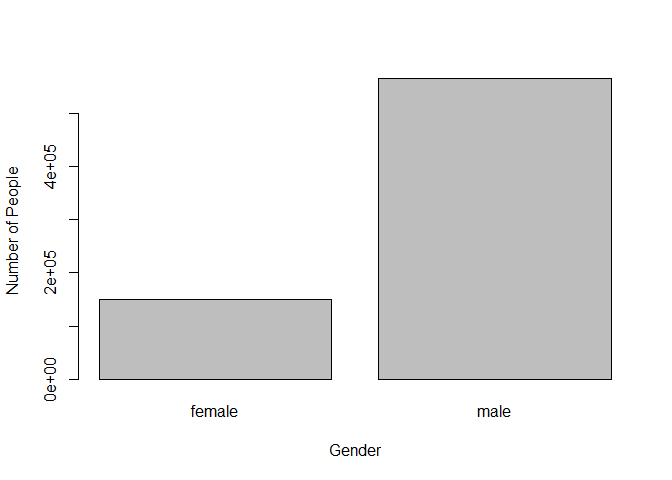

Exercise 2
================

## 1. The individual-level variables

``` r
library(arrow)
```

    ## 
    ## Attaching package: 'arrow'

    ## The following object is masked from 'package:utils':
    ## 
    ##     timestamp

``` r
df <- read_parquet("app_data_sample.parquet")
library(gender)
first_name <- df$examiner_name_first
genders <- gender(first_name, method = "demo", years = 2012)
library(wru)
df['surname'] <- df$examiner_name_last
new_df <- predict_race(df, surname.only = TRUE)
```

    ## [1] "Proceeding with surname-only predictions..."

    ## Warning in merge_surnames(voter.file): Probabilities were imputed for 247012
    ## surnames that could not be matched to Census list.

Problem: I know the highest possibility that which race each person can
be, but Can’t figure out how to calculate how many people are in each
race.

``` r
library(lubridate)
```

    ## 
    ## Attaching package: 'lubridate'

    ## The following object is masked from 'package:arrow':
    ## 
    ##     duration

    ## The following objects are masked from 'package:base':
    ## 
    ##     date, intersect, setdiff, union

``` r
library(tidyverse)
```

    ## -- Attaching packages --------------------------------------- tidyverse 1.3.1 --

    ## v ggplot2 3.3.5     v purrr   0.3.4
    ## v tibble  3.1.6     v dplyr   1.0.9
    ## v tidyr   1.2.0     v stringr 1.4.0
    ## v readr   2.1.2     v forcats 0.5.1

    ## -- Conflicts ------------------------------------------ tidyverse_conflicts() --
    ## x lubridate::as.difftime() masks base::as.difftime()
    ## x lubridate::date()        masks base::date()
    ## x lubridate::duration()    masks arrow::duration()
    ## x dplyr::filter()          masks stats::filter()
    ## x lubridate::intersect()   masks base::intersect()
    ## x dplyr::lag()             masks stats::lag()
    ## x lubridate::setdiff()     masks base::setdiff()
    ## x lubridate::union()       masks base::union()

``` r
examiner_dates <- df %>% 
  select(examiner_id, filing_date, appl_status_date) 
examiner_dates
```

    ## # A tibble: 2,018,477 x 3
    ##    examiner_id filing_date appl_status_date  
    ##          <dbl> <date>      <chr>             
    ##  1       96082 2000-01-26  30jan2003 00:00:00
    ##  2       87678 2000-10-11  27sep2010 00:00:00
    ##  3       63213 2000-05-17  30mar2009 00:00:00
    ##  4       73788 2001-07-20  07sep2009 00:00:00
    ##  5       77294 2000-04-10  19apr2001 00:00:00
    ##  6       68606 2000-04-28  16jul2001 00:00:00
    ##  7       89557 2004-01-26  15may2017 00:00:00
    ##  8       97543 2000-06-23  03apr2002 00:00:00
    ##  9       98714 2000-02-04  27nov2002 00:00:00
    ## 10       65530 2002-02-20  23mar2009 00:00:00
    ## # ... with 2,018,467 more rows

``` r
examiner_dates <- examiner_dates %>% 
  mutate(start_date = ymd(filing_date), end_date = as_date(dmy_hms(appl_status_date)))
```

``` r
library(skimr)
examiner_dates <- examiner_dates %>% 
  group_by(examiner_id) %>% 
  summarise(
    earliest_date = min(start_date, na.rm = TRUE), 
    latest_date = max(end_date, na.rm = TRUE),
    tenure = interval(earliest_date, latest_date) %/% days(1)
    )
examiner_dates
```

    ## # A tibble: 5,649 x 4
    ##    examiner_id earliest_date latest_date tenure
    ##          <dbl> <date>        <date>       <dbl>
    ##  1       59012 2004-07-28    2015-07-24    4013
    ##  2       59025 2009-10-26    2017-05-18    2761
    ##  3       59030 2005-12-12    2017-05-22    4179
    ##  4       59040 2007-09-11    2017-05-23    3542
    ##  5       59052 2001-08-21    2007-02-28    2017
    ##  6       59054 2000-11-10    2016-12-23    5887
    ##  7       59055 2004-11-02    2007-12-26    1149
    ##  8       59056 2000-03-24    2017-05-22    6268
    ##  9       59074 2000-01-31    2017-03-17    6255
    ## 10       59081 2011-04-21    2017-05-19    2220
    ## # ... with 5,639 more rows

``` r
skim(examiner_dates)
```

|                                                  |                |
|:-------------------------------------------------|:---------------|
| Name                                             | examiner_dates |
| Number of rows                                   | 5649           |
| Number of columns                                | 4              |
| \_\_\_\_\_\_\_\_\_\_\_\_\_\_\_\_\_\_\_\_\_\_\_   |                |
| Column type frequency:                           |                |
| Date                                             | 2              |
| numeric                                          | 2              |
| \_\_\_\_\_\_\_\_\_\_\_\_\_\_\_\_\_\_\_\_\_\_\_\_ |                |
| Group variables                                  | None           |

Data summary

**Variable type: Date**

| skim_variable | n_missing | complete_rate | min        | max        | median     | n_unique |
|:--------------|----------:|--------------:|:-----------|:-----------|:-----------|---------:|
| earliest_date |         0 |             1 | 2000-01-02 | 2016-03-03 | 2003-01-21 |     2325 |
| latest_date   |         0 |             1 | 2000-09-14 | 9468-10-16 | 2017-05-19 |      888 |

**Variable type: numeric**

| skim_variable | n_missing | complete_rate |     mean |       sd |    p0 |      p25 |   p50 |      p75 |    p100 | hist  |
|:--------------|----------:|--------------:|---------:|---------:|------:|---------:|------:|---------:|--------:|:------|
| examiner_id   |         1 |             1 | 78752.86 | 13575.30 | 59012 | 66531.75 | 75346 | 93750.75 |   99990 | ▇▆▃▂▇ |
| tenure        |         0 |             1 |  5844.53 | 54449.66 |    27 |  3125.00 |  4918 |  6097.00 | 2727903 | ▇▁▁▁▁ |

Problem: The tenure of each examiner is listed above. The problem is how
to export the data and use them to make a plot.

## 2. The Plots

Gender <!-- -->

Note that the `echo = FALSE` parameter was added to the code chunk to
prevent printing of the R code that generated the plot.
