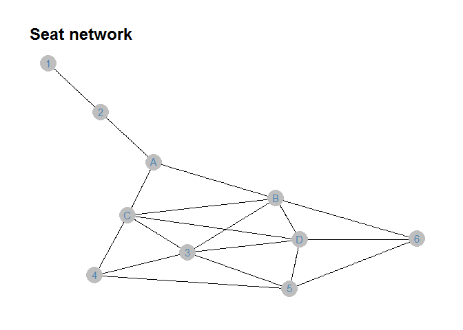
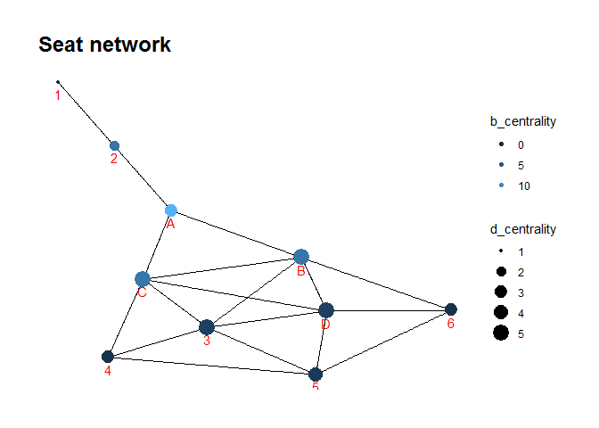

Exercise 4
================

## Define the network

``` r
# define nodes
node_names <- tibble(
  seat = c("A","B","C","D",1,2,3,4,5,6),
)
node_names
```

    ## # A tibble: 10 x 1
    ##    seat 
    ##    <chr>
    ##  1 A    
    ##  2 B    
    ##  3 C    
    ##  4 D    
    ##  5 1    
    ##  6 2    
    ##  7 3    
    ##  8 4    
    ##  9 5    
    ## 10 6

``` r
# define connections (have to correspond to ties 1-2, 2-A, A-B, A-C, B-D, B-C, B-3, C-D, C-3, C-4, D-3, D-5, 3-4, 5-3, 5-4, 6-5, 6-D, 6-B)
# for each element in `from` there is a corresponding element in `to`
edge_list <- tibble(
  from = c(1,2,"A","A","B","B","B","C","C","C","D","D",3,5,5,6,6,6),
  to   = c(2,"A","B","C","D","C",3,"D",3,4,3,5,4,3,4,5,"D","B")
)
edge_list
```

    ## # A tibble: 18 x 2
    ##    from  to   
    ##    <chr> <chr>
    ##  1 1     2    
    ##  2 2     A    
    ##  3 A     B    
    ##  4 A     C    
    ##  5 B     D    
    ##  6 B     C    
    ##  7 B     3    
    ##  8 C     D    
    ##  9 C     3    
    ## 10 C     4    
    ## 11 D     3    
    ## 12 D     5    
    ## 13 3     4    
    ## 14 5     3    
    ## 15 5     4    
    ## 16 6     5    
    ## 17 6     D    
    ## 18 6     B

``` r
# combine this information into a network graph object
seat_graph <- tbl_graph(nodes = node_names, edges = edge_list, directed = FALSE)
seat_graph
```

    ## # A tbl_graph: 10 nodes and 18 edges
    ## #
    ## # An undirected simple graph with 1 component
    ## #
    ## # Node Data: 10 x 1 (active)
    ##   seat 
    ##   <chr>
    ## 1 A    
    ## 2 B    
    ## 3 C    
    ## 4 D    
    ## 5 1    
    ## 6 2    
    ## # ... with 4 more rows
    ## #
    ## # Edge Data: 18 x 2
    ##    from    to
    ##   <int> <int>
    ## 1     5     6
    ## 2     1     6
    ## 3     1     2
    ## # ... with 15 more rows

``` r
seat_graph %>% 
    ggraph(layout = 'kk') + 
    geom_edge_link() + 
    geom_node_point(size = 8, colour = 'gray') +
    geom_node_text(aes(label = seat), colour = 'steelblue', vjust = 0.4) + 
    ggtitle('Seat network') + 
    theme_graph()
```

    ## Warning in grid.Call(C_stringMetric, as.graphicsAnnot(x$label)): font family not
    ## found in Windows font database

    ## Warning in grid.Call(C_textBounds, as.graphicsAnnot(x$label), x$x, x$y, : font
    ## family not found in Windows font database

    ## Warning in grid.Call(C_textBounds, as.graphicsAnnot(x$label), x$x, x$y, : font
    ## family not found in Windows font database

<!-- -->

``` r
seat_graph <- seat_graph %>% 
  activate(nodes) %>% # we need to state we'll be adding to nodes, not edges
  mutate(d_centrality = centrality_degree()) %>%  # adding measure of degree centrality
  mutate(b_centrality = centrality_betweenness()) # adding betweenness centrality
```

    ## Warning in betweenness(graph = graph, v = V(graph), directed = directed, :
    ## 'nobigint' is deprecated since igraph 1.3 and will be removed in igraph 1.4

``` r
seat_graph
```

    ## # A tbl_graph: 10 nodes and 18 edges
    ## #
    ## # An undirected simple graph with 1 component
    ## #
    ## # Node Data: 10 x 3 (active)
    ##   seat  d_centrality b_centrality
    ##   <chr>        <dbl>        <dbl>
    ## 1 A                3        14   
    ## 2 B                5         8.33
    ## 3 C                5         8.33
    ## 4 D                5         2.5 
    ## 5 1                1         0   
    ## 6 2                2         8   
    ## # ... with 4 more rows
    ## #
    ## # Edge Data: 18 x 2
    ##    from    to
    ##   <int> <int>
    ## 1     5     6
    ## 2     1     6
    ## 3     1     2
    ## # ... with 15 more rows

``` r
seat_graph %>% 
  ggraph(layout = 'kk') + 
  geom_edge_link() + 
  geom_node_point(aes(size = d_centrality, colour = b_centrality)) + 
  scale_color_continuous(guide = 'legend') +
  geom_node_text(aes(label = seat), colour = 'red', vjust = 1.6) + 
  ggtitle('Seat network') + 
  theme_graph()
```

    ## Warning in grid.Call(C_stringMetric, as.graphicsAnnot(x$label)): font family not
    ## found in Windows font database

    ## Warning in grid.Call(C_stringMetric, as.graphicsAnnot(x$label)): font family not
    ## found in Windows font database

    ## Warning in grid.Call(C_textBounds, as.graphicsAnnot(x$label), x$x, x$y, : font
    ## family not found in Windows font database

    ## Warning in grid.Call(C_textBounds, as.graphicsAnnot(x$label), x$x, x$y, : font
    ## family not found in Windows font database

    ## Warning in grid.Call(C_textBounds, as.graphicsAnnot(x$label), x$x, x$y, : font
    ## family not found in Windows font database

    ## Warning in grid.Call(C_textBounds, as.graphicsAnnot(x$label), x$x, x$y, : font
    ## family not found in Windows font database

    ## Warning in grid.Call(C_textBounds, as.graphicsAnnot(x$label), x$x, x$y, : font
    ## family not found in Windows font database

    ## Warning in grid.Call(C_textBounds, as.graphicsAnnot(x$label), x$x, x$y, : font
    ## family not found in Windows font database

    ## Warning in grid.Call(C_textBounds, as.graphicsAnnot(x$label), x$x, x$y, : font
    ## family not found in Windows font database

    ## Warning in grid.Call(C_textBounds, as.graphicsAnnot(x$label), x$x, x$y, : font
    ## family not found in Windows font database

<!-- -->

## Seat choice

1.  If we only look at the “centrality degree”, seat B, C, D are equally
    important.
2.  If we only look at the “centrality betweenness”, seat A is the most
    important one.
3.  If we combine the results, seat B and C will be the better choice.
    However, choosing B or C means we will give up on the opportunity of
    connecting with the people who sit on seat 1 and 2.
4.  Even though sitting on seat A we can’t have the chance to know as
    most people as possible, Seat A is the only spot that we can connect
    with both groups.
5.  In conclusion, if we want to know more people, we should sit on seat
    B or C. If we want to have a wider connection, we should sit on seat
    A.
