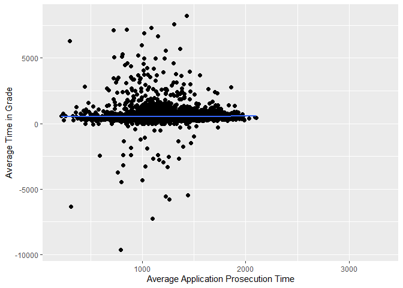

Exercise 5
================

## Loading data and preparing variables

``` r
# set path for R to find our data
data_path <- "D:/R/Assignment/PA assignment/"
library(arrow) # to be able to load data in the .parquet format
```

    ## 
    ## Attaching package: 'arrow'

    ## The following object is masked from 'package:utils':
    ## 
    ##     timestamp

``` r
# read application data
app_data_sample <- read_parquet(paste0(data_path,"app_data_sample.parquet"))
```

``` r
library(gender)
#install_genderdata_package() # only run this line the first time you use the package, to get data for it

# get a list of first names without repetitions
examiner_names <- app_data_sample %>% 
  distinct(examiner_name_first)
examiner_names_gender <- examiner_names %>% 
  do(results = gender(.$examiner_name_first, method = "ssa")) %>% 
  unnest(cols = c(results), keep_empty = TRUE) %>% 
  select(
    examiner_name_first = name,
    gender,
    proportion_female
  )

# remove extra colums from the gender table
examiner_names_gender <- examiner_names_gender %>% 
  select(examiner_name_first, gender)

# joining gender back to the dataset
app_data_sample <- app_data_sample %>% 
  left_join(examiner_names_gender, by = "examiner_name_first")

# cleaning up
rm(examiner_names)
rm(examiner_names_gender)
gc()
```

    ##            used  (Mb) gc trigger  (Mb) max used  (Mb)
    ## Ncells  4519691 241.4    8003674 427.5  4539871 242.5
    ## Vcells 49468575 377.5   95373303 727.7 79784351 608.8

``` r
# Examiners' race
library(wru)
examiner_surnames <- app_data_sample %>% 
  select(surname = examiner_name_last) %>% 
  distinct()
examiner_race <- predict_race(voter.file = examiner_surnames, surname.only = T) %>% 
  as_tibble()
```

    ## [1] "Proceeding with surname-only predictions..."

    ## Warning in merge_surnames(voter.file): Probabilities were imputed for 698
    ## surnames that could not be matched to Census list.

``` r
examiner_race <- examiner_race %>% 
  mutate(max_race_p = pmax(pred.asi, pred.bla, pred.his, pred.oth, pred.whi)) %>% 
  mutate(race = case_when(
    max_race_p == pred.asi ~ "Asian",
    max_race_p == pred.bla ~ "black",
    max_race_p == pred.his ~ "Hispanic",
    max_race_p == pred.oth ~ "other",
    max_race_p == pred.whi ~ "white",
    TRUE ~ NA_character_
  ))
examiner_race <- examiner_race %>% 
  select(surname,race)
app_data_sample <- app_data_sample %>% 
  left_join(examiner_race, by = c("examiner_name_last" = "surname"))
rm(examiner_race)
rm(examiner_surnames)
gc()
```

    ##            used  (Mb) gc trigger  (Mb) max used  (Mb)
    ## Ncells  4934270 263.6    8003674 427.5  8003674 427.5
    ## Vcells 53267627 406.4   95373303 727.7 94931570 724.3

``` r
# Examiner's tenure
library(lubridate) # to work with dates
```

    ## 
    ## Attaching package: 'lubridate'

    ## The following object is masked from 'package:arrow':
    ## 
    ##     duration

    ## The following objects are masked from 'package:base':
    ## 
    ##     date, intersect, setdiff, union

``` r
examiner_dates <- app_data_sample %>% 
  select(examiner_id, filing_date, appl_status_date) 
examiner_dates <- examiner_dates %>% 
  mutate(start_date = ymd(filing_date), end_date = as_date(dmy_hms(appl_status_date))) %>% 
  filter(year(end_date)<2018) %>% 
  group_by(examiner_id) %>% 
  summarise(
    earliest_date = min(start_date, na.rm = TRUE), 
    latest_date = max(end_date, na.rm = TRUE),
    tenure_days = interval(earliest_date, latest_date) %/% days(1)
    )
app_data_sample <- app_data_sample %>% 
  left_join(examiner_dates, by = "examiner_id")
rm(examiner_dates)
gc()
```

    ##            used  (Mb) gc trigger   (Mb)  max used   (Mb)
    ## Ncells  4949625 264.4   14386882  768.4  17983602  960.5
    ## Vcells 65648945 500.9  137513555 1049.2 137290644 1047.5

## Adding paygrade data

Load the paygrade file

``` r
examiner_gs <- read_csv(paste0(data_path,"examiner_gs.csv"))
```

    ## Rows: 52109 Columns: 6
    ## -- Column specification --------------------------------------------------------
    ## Delimiter: ","
    ## chr (3): examiner_name, start_date, end_date
    ## dbl (3): examiner_grade, old_pid, new_pid
    ## 
    ## i Use `spec()` to retrieve the full column specification for this data.
    ## i Specify the column types or set `show_col_types = FALSE` to quiet this message.

``` r
examiner_ids <- read_csv(paste0(data_path,"examiner_ids.csv"))
```

    ## Rows: 19454 Columns: 4
    ## -- Column specification --------------------------------------------------------
    ## Delimiter: ","
    ## chr (1): examiner_name
    ## dbl (3): old_pid, new_pid, patex_id
    ## 
    ## i Use `spec()` to retrieve the full column specification for this data.
    ## i Specify the column types or set `show_col_types = FALSE` to quiet this message.

## We need to replace various IDs with examiner ID

``` r
examiner_gs <- examiner_gs %>% 
  left_join(examiner_ids) %>% 
  select(
    grade = examiner_grade,
    start_date,
    end_date,
    examiner_id = patex_id
  )
```

    ## Joining, by = c("examiner_name", "old_pid", "new_pid")

## Estimate time in grade

``` r
time_in_grade <- examiner_gs %>% 
  mutate(
    start_date = mdy(start_date), # converting into proper date type
    end_date = mdy(end_date), # converting into proper date type
    days_in_grade = interval(start_date, end_date) %/% days(1)
  ) %>% 
  group_by(examiner_id) %>% 
  filter(grade!=max(grade, na.rm = TRUE)) %>% # dropping the highest grade record
  summarise(mean_days_in_grade = mean(days_in_grade, na.rm = TRUE))
time_in_grade
```

    ## # A tibble: 10,860 x 2
    ##    examiner_id mean_days_in_grade
    ##          <dbl>              <dbl>
    ##  1       59012               356.
    ##  2       59015               783 
    ##  3       59016               341.
    ##  4       59018               368.
    ##  5       59019               293 
    ##  6       59025               485 
    ##  7       59027               364.
    ##  8       59030               493.
    ##  9       59033               258.
    ## 10       59035               308.
    ## # ... with 10,850 more rows

## Prepare application data

``` r
examiner_data <- app_data_sample %>% 
  filter(disposal_type!="PEND") %>% # here, we exclude in-process applications
  mutate(
    app_start_date = ymd(filing_date),
    app_end_date = case_when(
      disposal_type == "ISS" ~ ymd(patent_issue_date), # for issued patents
      disposal_type == "ABN" ~ ymd(abandon_date), # for abandoned applications
      TRUE ~ NA_Date_
    ),
    app_proc_days = interval(app_start_date, app_end_date) %/% days(1)) %>% 
  filter(app_proc_days>0 & app_proc_days < 3650) %>% # limit to 0-10 years
  group_by(examiner_id) %>% 
  summarise(
    app_count = n(),
    tc = min(tc, na.rm = TRUE),
    gender = first(gender),
    race = first(race),
    tenure_days = max(tenure_days, na.rm = TRUE),
    mean_app_proc_days = mean(app_proc_days, na.rm = TRUE)
  )
examiner_data
```

    ## # A tibble: 5,549 x 7
    ##    examiner_id app_count    tc gender race  tenure_days mean_app_proc_days
    ##          <dbl>     <int> <dbl> <chr>  <chr>       <dbl>              <dbl>
    ##  1       59012        84  1700 male   white        4013              1295.
    ##  2       59025        96  2400 male   Asian        2761              1152.
    ##  3       59030       358  2400 <NA>   black        4179              1008.
    ##  4       59040       233  1700 female Asian        3542              1305.
    ##  5       59052         8  2100 male   Asian        2017               535.
    ##  6       59054        10  2100 <NA>   Asian        5887              1297 
    ##  7       59055         2  2100 male   Asian        1149               932.
    ##  8       59056      1019  2100 male   Asian        6268              1077.
    ##  9       59074       166  2100 <NA>   white        6255              1579.
    ## 10       59081        48  2400 male   Asian        2220              1317.
    ## # ... with 5,539 more rows

Now, let’s join in the time in grade data.

``` r
examiner_data <- examiner_data %>% 
  left_join(time_in_grade)
```

    ## Joining, by = "examiner_id"

``` r
examiner_data
```

    ## # A tibble: 5,549 x 8
    ##    examiner_id app_count    tc gender race  tenure_days mean_app_proc_days
    ##          <dbl>     <int> <dbl> <chr>  <chr>       <dbl>              <dbl>
    ##  1       59012        84  1700 male   white        4013              1295.
    ##  2       59025        96  2400 male   Asian        2761              1152.
    ##  3       59030       358  2400 <NA>   black        4179              1008.
    ##  4       59040       233  1700 female Asian        3542              1305.
    ##  5       59052         8  2100 male   Asian        2017               535.
    ##  6       59054        10  2100 <NA>   Asian        5887              1297 
    ##  7       59055         2  2100 male   Asian        1149               932.
    ##  8       59056      1019  2100 male   Asian        6268              1077.
    ##  9       59074       166  2100 <NA>   white        6255              1579.
    ## 10       59081        48  2400 male   Asian        2220              1317.
    ## # ... with 5,539 more rows, and 1 more variable: mean_days_in_grade <dbl>

## How long does it take, on average, men and women to advance to the next pay grade?

``` r
male_data <- examiner_data[examiner_data$gender == "male", ] %>% 
  na.omit(male_data)
mean(male_data$mean_days_in_grade)
```

    ## [1] 546.1771

``` r
female_data <- examiner_data[examiner_data$gender == "female", ] %>% 
  na.omit(female_data)
mean(female_data$mean_days_in_grade)
```

    ## [1] 542.1556

1.  On average, it takes men 546 days to advance to the next pay grade
    and it takes women 542 days.

2.  Available data of “mean_days_in_grade”

    Male: 2654

    Female: 1184

## Are these differences themselves different by examiners’ race?

``` r
white_data <- examiner_data[examiner_data$race == "white", ] 
white_data_2 <- white_data[!is.na(white_data$mean_days_in_grade), ]
mean(white_data_2$mean_days_in_grade)
```

    ## [1] 551.0042

``` r
black_data <- examiner_data[examiner_data$race == "black", ] 
black_data_2 <- black_data[!is.na(black_data$mean_days_in_grade), ]
mean(black_data_2$mean_days_in_grade)
```

    ## [1] 589.2735

``` r
Asian_data <- examiner_data[examiner_data$race == "Asian", ] 
Asian_data_2 <- Asian_data[!is.na(Asian_data$mean_days_in_grade), ]
mean(Asian_data_2$mean_days_in_grade)
```

    ## [1] 534.5086

``` r
Hispanic_data <- examiner_data[examiner_data$race == "Hispanic", ] 
Hispanic_data_2 <- Hispanic_data[!is.na(Hispanic_data$mean_days_in_grade), ]
mean(Hispanic_data_2$mean_days_in_grade)
```

    ## [1] 504.2059

``` r
other_data <- examiner_data[examiner_data$race == "other", ] 
other_data_2 <- other_data[!is.na(other_data$mean_days_in_grade), ]
mean(other_data_2$mean_days_in_grade)
```

    ## [1] 467.2

1.  If we only look at the average days that people of different races
    use to advance to the next level, except black, the results of the
    minor races (Asian, Hispanic, and other) seemed shorter than the
    results of the major race (white) in the US.

2.  However, if we pay attention to the data set, we will see that the
    available data of different races are various.

    Available data of “mean_days_in_grade”

    White: 2740

    Black: 189

    Asian: 1385

    Hispanic: 188

    Other: 1

3.  Therefore, we can’t simply conclude that race has a significant
    impact on the average days of advancing to the next pay grade.

## Descriptive statistics and regressions

1.  The plot that shows the correlation between prosecution days and
    days in grade

``` r
ggplot(data=examiner_data, 
       mapping=aes(x=mean_app_proc_days, 
                   y=mean_days_in_grade))+ 
  geom_point(size=2)+ 
  geom_smooth(method=lm, se = F)+ 
  xlab("Average Application Prosecution Time")+ 
  ylab("Average Time in Grade")
```

    ## `geom_smooth()` using formula 'y ~ x'

    ## Warning: Removed 1046 rows containing non-finite values (stat_smooth).

    ## Warning: Removed 1046 rows containing missing values (geom_point).

<!-- -->

2.  The plot that shows the correlation between prosecution days, gender
    and days in grade

``` r
ggplot(data=examiner_data, 
       mapping=aes(x=mean_app_proc_days, 
                   y=mean_days_in_grade, 
                   color=gender))+ 
  geom_point(size=2)+ 
  geom_smooth(method=lm, se = F)+ 
  xlab("Average Application Prosecution Time")+
  ylab("Average Time in Grade")
```

    ## `geom_smooth()` using formula 'y ~ x'

    ## Warning: Removed 1046 rows containing non-finite values (stat_smooth).

    ## Warning: Removed 1046 rows containing missing values (geom_point).

<!-- -->

3.  The plot that shows the correlation between prosecution days, race
    and days in grade

``` r
ggplot(data=examiner_data, 
       mapping=aes(x=mean_app_proc_days, 
                   y=mean_days_in_grade, 
                   color=race))+ 
  geom_point(size=2)+ 
  geom_smooth(method=lm, se = F)+ 
  xlab("Average Application Prosecution Time")+
  ylab("Average Time in Grade")
```

    ## `geom_smooth()` using formula 'y ~ x'

    ## Warning: Removed 1046 rows containing non-finite values (stat_smooth).

    ## Warning: Removed 1046 rows containing missing values (geom_point).

<!-- -->

4.  Let’s run a couple of simple regressions.

``` r
library(modelsummary)
models <- list()
models[['m1']] <- lm(mean_days_in_grade ~ 1 + mean_app_proc_days, data = examiner_data) 
models[['m2']] <- lm(mean_days_in_grade ~ 1 + as_factor(gender), data = examiner_data) 
models[['m3']] <- lm(mean_days_in_grade ~ 1 + as_factor(race), data = examiner_data)
models[['m4']] <- lm(mean_days_in_grade ~ 1 + mean_app_proc_days + as_factor(gender), 
                     data = examiner_data) 
models[['m5']] <- lm(mean_days_in_grade ~ 1 + mean_app_proc_days + as_factor(race), 
                     data = examiner_data) 
models[['m6']] <- lm(mean_days_in_grade ~ 1 + mean_app_proc_days + as_factor(gender) +   
                     as_factor(race), data = examiner_data)

modelsummary(models)
```

|                         |     m1     |     m2     |     m3     |     m4     |     m5     |     m6     |
|:------------------------|:----------:|:----------:|:----------:|:----------:|:----------:|:----------:|
| (Intercept)             |  528.481   |  546.177   |  551.004   |  550.975   |  531.761   |  552.690   |
|                         |  (43.856)  |  (13.223)  |  (12.504)  |  (49.860)  |  (44.213)  |  (50.105)  |
| mean_app_proc_days      |   0.014    |            |            |   -0.004   |   0.016    |   -0.003   |
|                         |  (0.035)   |            |            |  (0.039)   |  (0.035)   |  (0.040)   |
| as_factor(gender)female |            |   -4.021   |            |   -4.166   |            |   -4.611   |
|                         |            |  (23.807)  |            |  (23.854)  |            |  (23.871)  |
| as_factor(race)Asian    |            |            |  -16.496   |            |  -17.130   |   -9.874   |
|                         |            |            |  (21.580)  |            |  (21.627)  |  (25.693)  |
| as_factor(race)black    |            |            |   38.269   |            |   38.196   |   51.199   |
|                         |            |            |  (49.226)  |            |  (49.231)  |  (60.209)  |
| as_factor(race)Hispanic |            |            |  -46.798   |            |  -46.940   |  -46.899   |
|                         |            |            |  (49.348)  |            |  (49.354)  |  (53.547)  |
| as_factor(race)other    |            |            |  -83.804   |            |  -86.266   |  -81.593   |
|                         |            |            | (654.666)  |            | (654.746)  | (681.698)  |
| Num.Obs.                |    4503    |    3838    |    4503    |    3838    |    4503    |    3838    |
| R2                      |   0.000    |   0.000    |   0.000    |   0.000    |   0.001    |   0.000    |
| R2 Adj.                 |   0.000    |   0.000    |   0.000    |   -0.001   |   -0.001   |   -0.001   |
| AIC                     |  71176.4   |  60973.0   |  71180.3   |  60975.0   |  71182.1   |  60981.3   |
| BIC                     |  71195.6   |  60991.8   |  71218.8   |  61000.0   |  71227.0   |  61031.3   |
| Log.Lik.                | -35585.191 | -30483.512 | -35584.174 | -30483.507 | -35584.071 | -30482.639 |
| F                       |   0.160    |   0.029    |   0.548    |   0.019    |   0.480    |   0.295    |
| RMSE                    |   654.48   |   681.21   |   654.55   |   681.30   |   654.60   |   681.50   |

1). Based on the table, there is no significant linear relationship
between the average days in a pay grade and the average application
prosecution time/race/gender.

2). The results could be heavily influenced by the fact that there are
many missing data, for example, the unknown gender of some examiners and
the unknown average days in a pay grade of some examiners.

3). Another limitation is that, there is a big gap between the number of
white employees and employees from all the minor races. The incomparable
number of employees of each race makes it hard to draw conclusions from
the data set.

4). There are many examiners have a average days in a pay grade that is
below zero, which also can’t contribute to the analysis.
